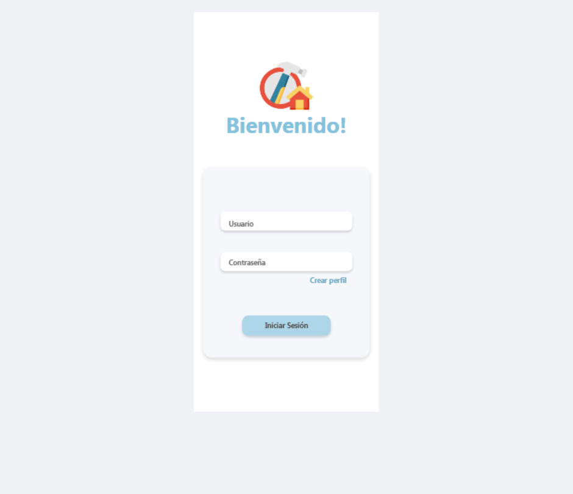
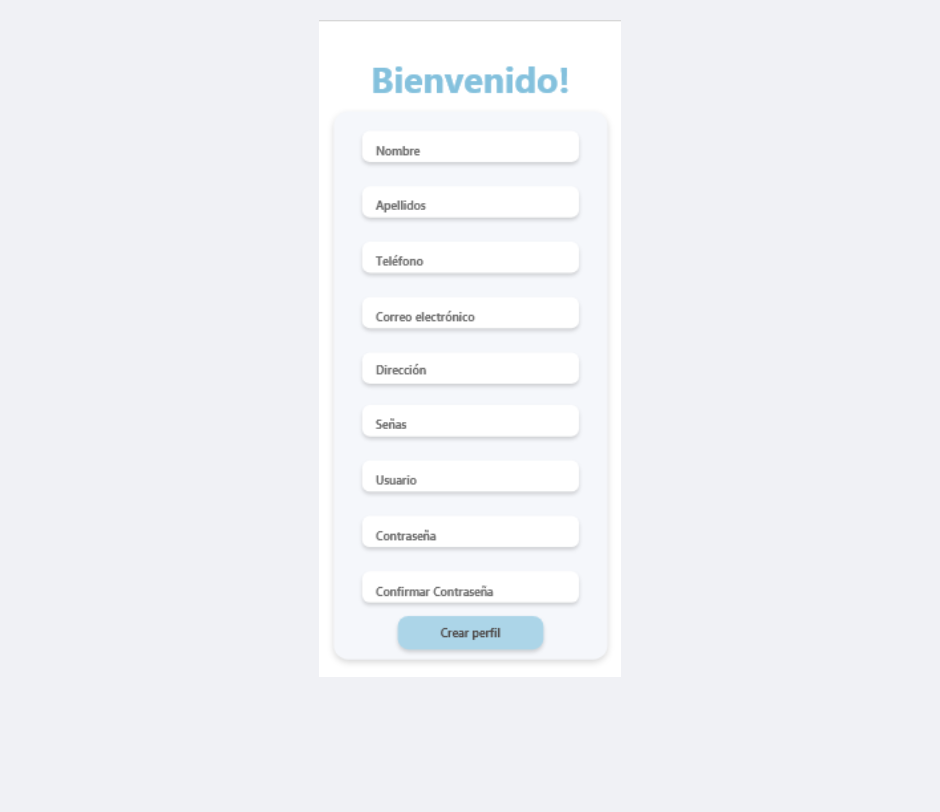
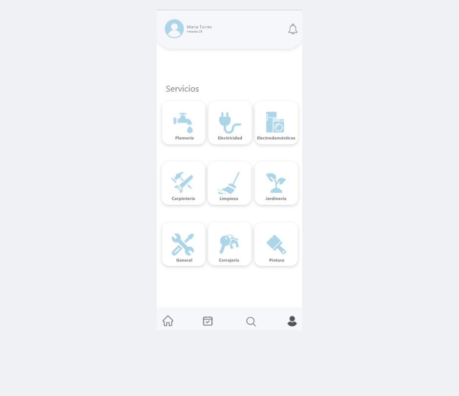
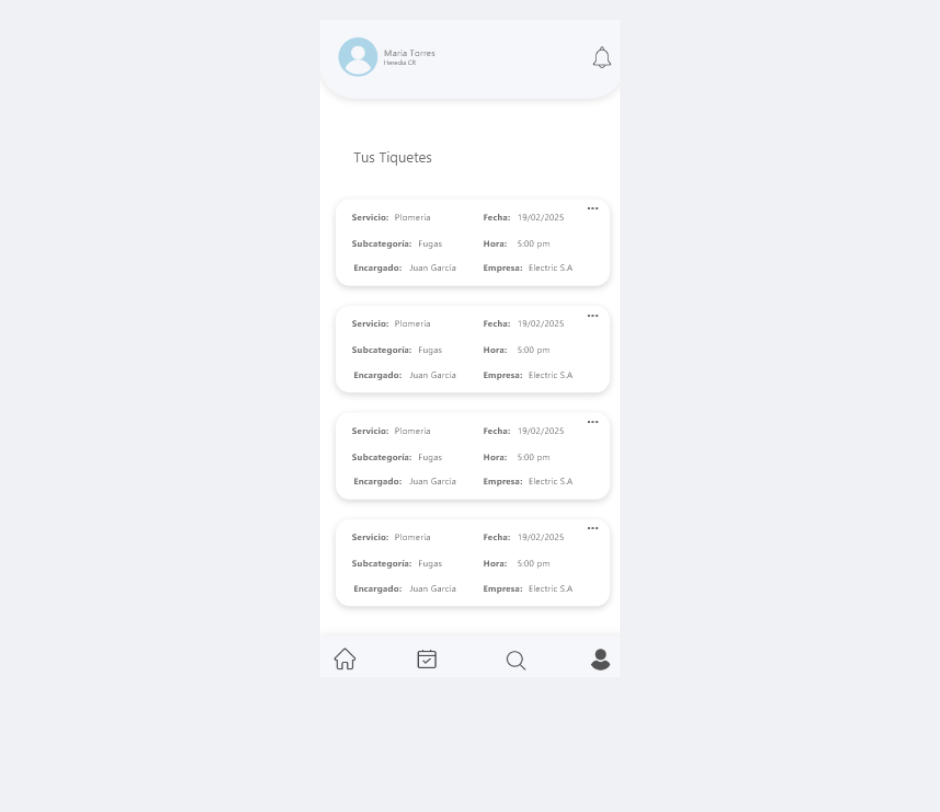
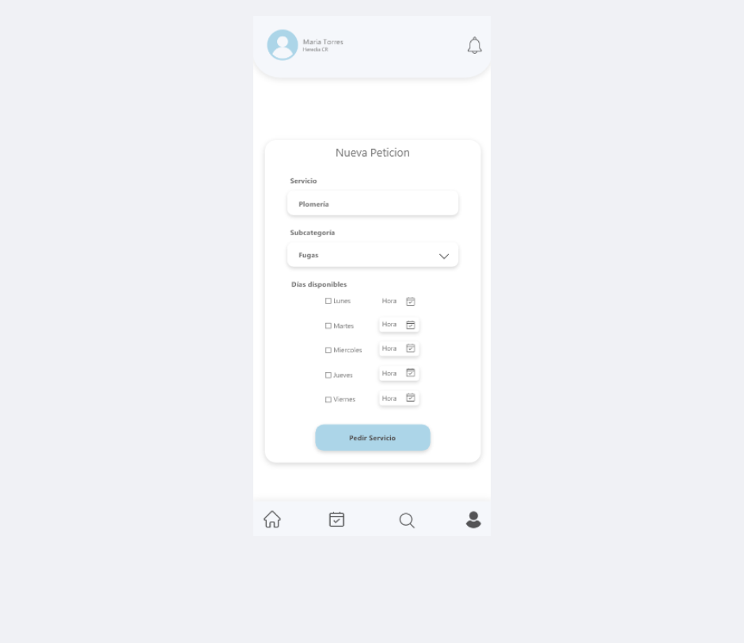
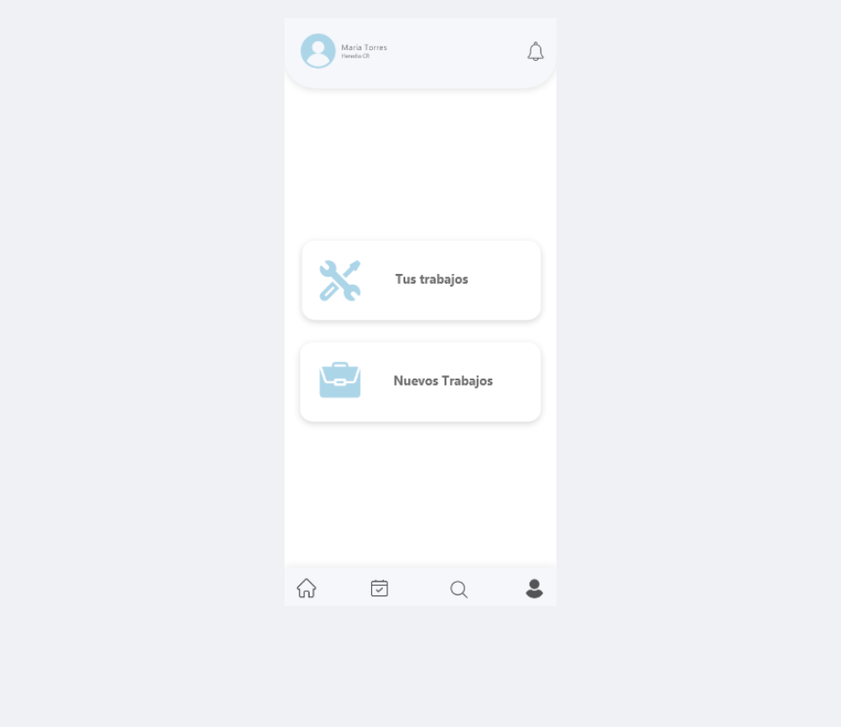
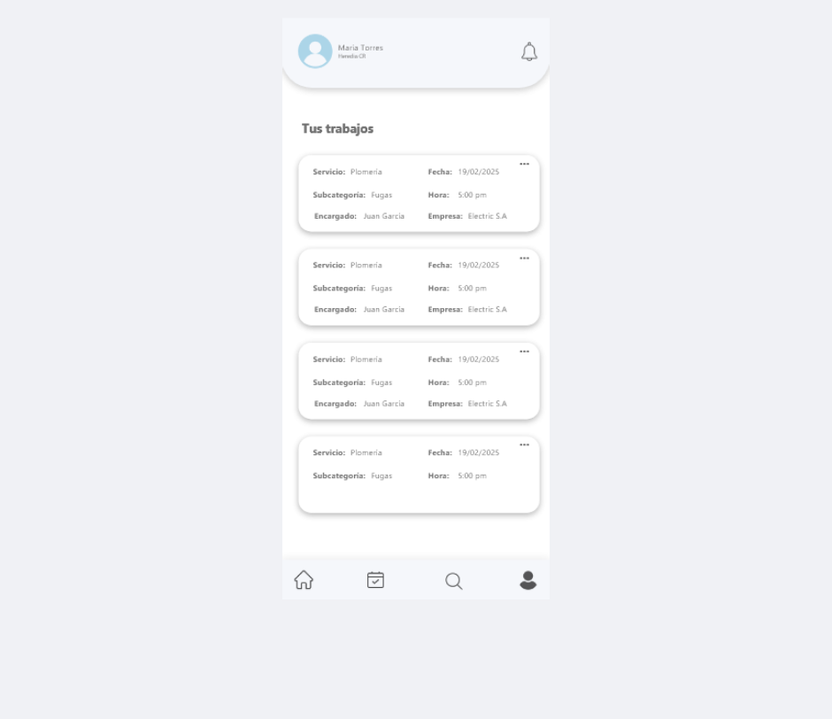
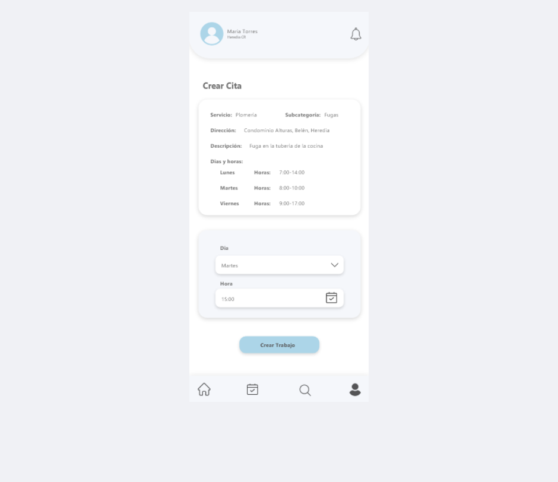
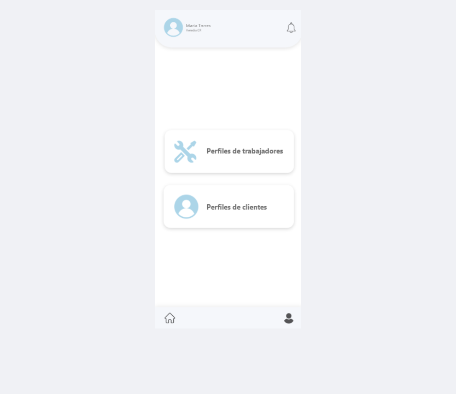

# 📱 FixGo

**FixGo** es una aplicación móvil desarrollada con **.NET 8 MAUI** para el frontend y **C# / LINQ / SQL Server** para el backend.  
Permite la gestión de servicios como jardinería, fontanería, electricidad y otros, conectando a clientes con trabajadores de manera rápida y sencilla.

---

## Tecnologías utilizadas
- **Frontend:** .NET 8 MAUI (Visual Studio 2022)
- **Backend:** C# con LINQ y procedimientos almacenados
- **Base de datos:** SQL Server
- **IDE:** Visual Studio 2022

---

## Características principales
- Gestión de usuarios con roles (Administrador, Cliente y Trabajador).
- Inicio de sesión con validación de credenciales y control de acceso.
- Registro y asignación de servicios.
- Historial de servicios para clientes y trabajadores.
- Calificación de trabajadores (1 a 5 estrellas).
- Integración con base de datos SQL Server para almacenamiento seguro.

---

## 📷 Capturas de pantalla

### Autenticación



### Cliente




### Trabajador




### Administrador


---

## Instalación y configuración

### 1. Clonar el repositorio
```bash
git clone https://github.com/fiorod/mi-portafolio.git
```

### 2. Backend

Abrir la solución en Visual Studio 2022.

Configurar la cadena de conexión en el archivo de constantes o configuración (ej. Constants.cs o appsettings.json).

Ejecutar el script de base de datos en SQL Server.

### 3. Frontend

Compilar el proyecto MAUI.

Seleccionar el dispositivo/emulador deseado.

Ejecutar con F5 desde Visual Studio.

## Este proyecto está bajo la licencia MIT. Consulta el archivo LICENSE para más información.

Autor:
Fiorella Rodríguez Chinchilla
correo: fio.rodrigch@gmail.com

